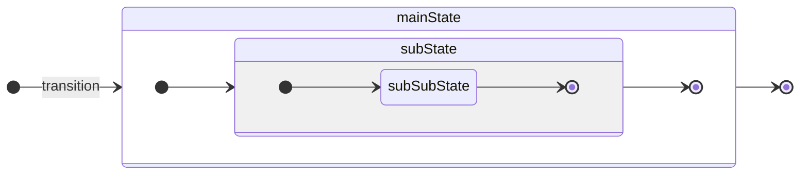

```mermaid
stateDiagram-v2
direction LR
  state Kafka-Cluster {
    direction LR
    state Broker {
      direction LR
      Tópico-1
	  Tópico-2
    }
  }
```

```mermaid
stateDiagram-v2
direction LR
  [*] --> mainState: transition
  state mainState {
    direction LR
    [*] --> subState
    state subState {
      direction LR
      [*] --> subSubState
      subSubState --> [*]
    }
    subState --> [*]
  }
  mainState --> [*]
```

```mermaid
graph TD;
    A-->B;
    A-->C;
    B-->D;
    C-->D;
```