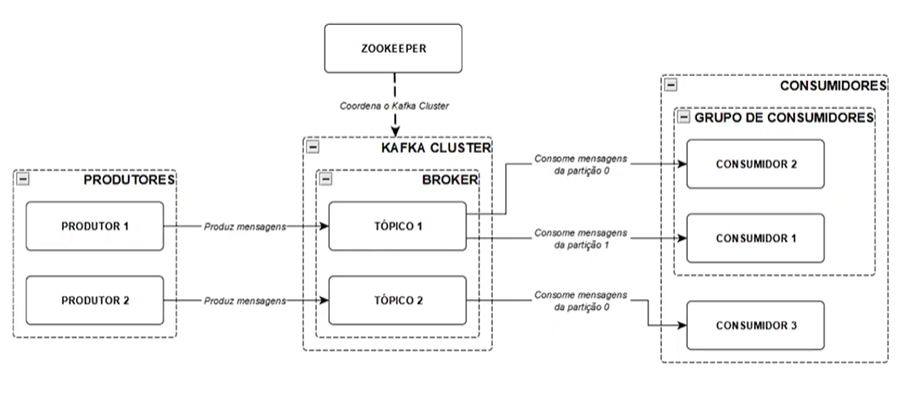

<br/>

Este documento é um guia sobre os principais conceitos e configurações.

# ⚙️ Arquitetura do Kafka


# 🎛️ Componentes
## 🔷 **Broker**
**Definição:** Servidores que armazenam e gerenciam as partições dos tópicos no Kafka.<br/>
**Funcionamento:** Constituem o cluster Kafka e são responsáveis por receber, armazenar e replicar os dados.<br/>
**Características:** Escalabilidade horizontal e replicação de dados.<br/>
**Uso Prático:** Executam em servidores dedicados ou em contêineres, dependendo dos requisitos de escala e desempenho.<br/>
**Benefícios:** Oferecem armazenamento confiável e distribuído para os dados e permitem dimensionar horizontalmente para lidar com volumes crescentes de dados.<br/>

| Configuração | Descrição |
| ------- | --------- |
| `broker.id` | Identificador único para cada broker no cluster Kafka. |
| `listeners` | Endereço e porta para o qual o broker está configurado para escutar conexões de clientes e outros brokers. |
| `log.dirs` | Diretório onde os logs de segmentos de dados do Kafka serão armazenados. |
| `num.partitions` | Número padrão de partições que serão criadas para cada tópico automaticamente, a menos que seja especificado de outra forma durante a criação. |
| `auto.create.topics.enable` | Indica se o Kafka deve criar automaticamente tópicos quando os produtores os publicam pela primeira vez. |
| `default.replication.factor` | Número padrão de réplicas para serem mantidas para cada tópico. |
| `min.insync.replicas` | Número mínimo de réplicas que devem estar em sincronia para que uma gravação seja considerada bem-sucedida. |
| `log.retention.hours` | Número de horas para quanto tempo os segmentos de log de uma partição serão mantidos antes de serem descartados. |
| `log.segment.bytes` | Tamanho máximo em bytes de cada segmento de log antes que um novo segmento seja criado. |
| `num.recovery.threads.per.data.dir` | Número de threads de recuperação por diretório de log. |

## 🔷 **Tópico**
**Definição:** Canais de comunicação categorizados para dados no Kafka.<br/>
**Funcionamento:** Produtores enviam mensagens para tópicos, essas mensagens são consumidas por consumidores. Tópicos podem ter múltiplas partições para distribuição e paralelismo, e cada partição possui vários offsets. Cada partição só pode ser consumida por um consumidor.<br/>
**Características:** Flexibilidade na criação e configuração e suporta retenção de mensagens por tempo ou tamanho.<br/>
**Uso Prático:** Mensagens direcionadas a tópicos específicos para organização eficiente.<br/>
**Benefícios:** Facilita a organização e gerenciamento de dados, permite processamento paralelo e distribuído.


| Configuração | Descrição |
| ------- | --------- |
| `num.partitions` | Número de partições que serão criadas para o tópico. |
| `replication.factor` | Número de réplicas a serem mantidas para cada partição do tópico. |
| `retention.ms` | Tempo de retenção padrão em milissegundos para mensagens em uma partição antes que sejam descartadas. |
| `cleanup.policy` | Política de limpeza de log para o tópico. Pode ser "delete" para excluir mensagens antigas ou "compact" para compactar mensagens. |
| `min.insync.replicas` | Número mínimo de réplicas que devem estar em sincronia para que uma gravação seja considerada bem-sucedida. |
| `segment.bytes` | Tamanho máximo em bytes de cada segmento de log antes que um novo segmento seja criado. |
| `retention.bytes` | Tamanho máximo em bytes de mensagens que podem ser retidas em uma partição antes que sejam lidas. |
| `max.message.bytes` | Tamanho máximo em bytes permitido para uma única mensagem. |
| `message.timestamp.type` | Tipo de timestamp a ser usado para mensagens. Pode ser "CreateTime" ou "LogAppendTime". |
| `message.timestamp.difference.ms` | O intervalo máximo de tempo em milissegundos pelos quais o timestamp da mensagem pode ser mais recente do que o tempo de registro do broker. |

<details>
    <summary><strong style="font-size:1.2em;">🎮 <b>Principais comandos do tópico</b></strong></summary><br/>

Cria um novo tópico especificando algumas configurações:    
```bash
kafka-topics.sh --create --bootstrap-server <host_bootstrap>:<porta_bootstrap> --replication-factor <fator_replicaçao> --partitions <num_partições> --topic <nome_tópico>
```
Lista todos os tópicos disponíveis no cluster:
```bash
kafka-topics.sh --list --bootstrap-server <host_bootstrap>:<porta_bootstrap>
```
Fornece informações detalhadas sobre um tópico específico, incluindo partições e réplicas:
```bash
kafka-topics.sh --describe --bootstrap-server <host_bootstrap>:<porta_bootstrap> --topic <nome_tópico>
```
Exclui o tópico especificado:
```bash
kafka-topics.sh --delete --bootstrap-server <host_bootstrap>:<porta_bootstrap> --topic <nome_tópico>
```
Altera a configuração de um tópico, como políticas de retenção ou políticas de limpeza:
```bash
kafka-configs.sh --alter --bootstrap-server <host_bootstrap>:<porta_bootstrap> --entity-type topics --entity-name <nome_tópico> --add-config retention.ms=<tempo_retenção_em_ms>
```
Aumenta ou diminui o número de partições para um tópico:
```bash
kafka-topics.sh --alter --bootstrap-server <host_bootstrap>:<porta_bootstrap> --topic <nome_tópico> --partitions <novo_número_partições>
```
</details>

## 🔷 **Produtor**
**Definição:** Responsável por enviar dados para o Kafka.<br/>
**Funcionamento:** Envia mensagens para tópicos Kafka de forma assíncrona ou síncrona.<br/>
**Características:** Alta taxa de transferência, tolerância a falhas, configurações flexíveis.<br/>
**Uso P**rático: Aplicativos web, IoT, sistemas distribuídos.<br/>
**Benefícios:** Facilita a ingestão de dados em tempo real, escalabilidade, integração fácil.<br/>

| Configuração | Descrição |
| ------- | --------- |
| `bootstrap.servers` | Lista de servidores Kafka utilizados para inicializar a conexão do produtor com o cluster. |
| `acks` | Define o número de réplicas em que a mensagem deve ser confirmada como gravada antes de o produtor receber uma resposta. |
| `retries` | Número máximo de tentativas de reenvio em caso de falha no envio da mensagem. |
| `batch.size` | Tamanho máximo em bytes de cada lote de mensagens a serem enviadas ao broker. |
| `linger.ms` | Tempo máximo em milissegundos que o produtor aguardará para enviar um lote completo de mensagens. |
| `buffer.memory` | Tamanho total de memória em bytes a ser utilizado para armazenar as mensagens antes do envio ao broker. |
| `key.serializer` | Classe responsável por serializar a chave da mensagem. |
| `value.serializer` | Classe responsável por serializar o valor da mensagem. |

<details>
    <summary><strong style="font-size:1.2em;">🎮 <b>Principais comandos do produtor</b></strong></summary><br/>

Inicia um produtor de console que envia mensagens para o tópico Kafka especificado:
```bash
kafka-console-producer.sh --broker-list <lista_brokers> --topic <nome_tópico>
```
Inicia um produtor de console que envia mensagens com chaves para o tópico Kafka especificado:
```bash
kafka-console-producer.sh --broker-list <lista_brokers> --topic <nome_tópico> --property parse.key=true --property key.separator=<separador_chave>
```
Testa o desempenho do produtor enviando um número específico de registros para o tópico Kafka especificado:
```bash
kafka-producer-perf-test.sh --producer.config <arquivo_config_producer> --topic <nome_tópico> --num-records <num_registros> --record-size <tamanho_registro>
```
Inicia um produtor de console verificável que envia mensagens para o tópico Kafka especificado:
```bash
kafka-verifiable-producer.sh --broker-list <lista_brokers> --topic <nome_tópico> --max-messages <max_mensagens>
```
Inicia um produtor de console que envia mensagens Avro para o tópico Kafka especificado:
```bash
kafka-avro-console-producer --broker-list <lista_brokers> --topic <nome_tópico> --property value.schema='<schema_avro>'
```
</details>

## 🔷 **Consumidor**
**Definição:** Aplicativos ou sistemas que recebem e processam os dados do Kafka.<br/>
**Funcionamento:** Os consumidores se inscrevem nos tópicos para receber mensagens e processá-las conforme necessário. Podem ser implementados em diferentes linguagens e podem ser configurados para consumir mensagens de forma síncrona ou assíncrona.<br/>
**Características:** Flexibilidade na configuração do comportamento de consumo, como controle de offset e commits automáticos e capacidade de dimensionamento para lidar com grandes volumes de mensagens.<br/>
**Uso Prático:** Os consumidores podem processar e analisar dados em tempo real, gerando insights ou tomando ações com base nas mensagens recebidas.<br/>
**Benefícios:** Facilita a implementação de sistemas distribuídos e processamento de dados em tempo real e permite a integração com uma variedade de aplicativos e sistemas.<br/>


> ⚠️ Sempre após o consumidor processar a mensagem, é preciso realizar o processo de `commit`, ou seja, informar para o Kafka que a mensagem foi lida. Caso o `commit` não seja feito, o Kafka após um período configurado disponibilizará a mensagem novamente para ser consumida.<br/>
Através da propriedade `enable.auto.commit` é possível configurar o `commit` automático após a leitura das mensagens, para que essa ação não precise ficar na mão do desenvolvedor, porém é uma prática arriscada pois caso a mensagem não tenha sido processada pelo consumer, ela será perdida.
<br/>

| Configuração | Descrição |
| ------- | --------- |
| `group.id` | Identificador do grupo de consumidores ao qual o consumidor pertence. |
| `bootstrap.servers` | Lista de servidores Kafka utilizados para inicializar a conexão do consumidor com o cluster. |
| `auto.offset.reset` | Define o comportamento do consumidor quando não possui um offset inicial ou quando o offset não está mais disponível no servidor. |
| `enable.auto.commit` | Indica se os offsets de leitura devem ser automaticamente confirmados pelo consumidor. |
| `auto.commit.interval.ms` | Intervalo de tempo entre os commits automáticos dos offsets pelo consumidor. |
| `max.poll.records` | Número máximo de registros que o consumidor buscará em cada solicitação de poll. |
| `fetch.min.bytes` | Mínimo de bytes a serem buscados antes que os dados estejam disponíveis para o consumidor. |
| `fetch.max.wait.ms` | Tempo máximo de espera antes de retornar dados para o consumidor. |
| `session.timeout.ms` | Tempo máximo de inatividade antes que um consumidor seja considerado morto e removido do grupo. |
| `heartbeat.interval.ms` | Frequência com que o consumidor envia heartbeats ao coordenador do grupo. 
| `max.partition.fetch.bytes` | Máximo de bytes que o consumidor buscará de cada partição em uma única solicitação de busca. |

<details>
    <summary><strong style="font-size:1.2em;">🎮 <b>Principais comandos do consumidor</b></strong></summary><br/>

Inicia um consumidor de console que lê mensagens do tópico Kafka especificado.
```bash
kafka-console-consumer.sh --bootstrap-server <lista_brokers> --topic <nome_tópico>
```
Inicia um consumidor de console que lê todas as mensagens desde o início do tópico Kafka especificado.
```bash
kafka-console-consumer.sh --bootstrap-server <lista_brokers> --topic <nome_tópico> --from-beginning
```
Inicia um consumidor de console que lê um número específico de mensagens do tópico Kafka especificado.
```bash
kafka-console-consumer.sh --bootstrap-server <lista_brokers> --topic <nome_tópico> --max-messages <max_mensagens>
```
Inicia um consumidor de console que exibe chaves junto com mensagens do tópico Kafka especificado.
```bash
kafka-console-consumer.sh --bootstrap-server <lista_brokers> --topic <nome_tópico> --property print.key=true --property key.separator=<separador_chave>
```
Inicia um consumidor de console que exibe carimbos de data/hora junto com mensagens do tópico Kafka especificado.
```bash
kafka-console-consumer.sh --bootstrap-server <lista_brokers> --topic <nome_tópico> --property print.timestamp=true
```
Inicia um consumidor de console que lê mensagens Avro do tópico Kafka especificado.
```bash
kafka-avro-console-consumer --bootstrap-server <lista_brokers> --topic <nome_tópico> --from-beginning --property schema.registry.url='<url_registro_schema>'
```
</details>

## 🔷 **Grupo de consumidores**
**Definição:** Conjuntos de consumidores que compartilham a carga de processamento dos dados no Kafka.<br/>
**Funcionamento:** Os consumidores são organizados em grupos para consumir dados de tópicos específicos e cada mensagem é processada por apenas um consumidor dentro do grupo, garantindo a distribuição equitativa da carga.<br/>
**Características:** Permite dimensionar horizontalmente o processamento de mensagens e garante alta disponibilidade e tolerância a falhas.<br/>
**Uso Prático:** Ideal para lidar com volumes significativos de mensagens, distribuindo a carga de processamento entre vários consumidores.<br/>
**Benefícios:** Aumenta a eficiência do processamento de mensagens ao distribuir a carga entre vários consumidores e garante a continuidade do serviço, mesmo em caso de falha de um consumidor.

| Configuração | Descrição |
| ------- | --------- |
| `group.id` | Identificador do grupo de consumidores ao qual o consumidor pertence. |
| `bootstrap.servers` | Lista de servidores Kafka utilizados para inicializar a conexão do consumidor com o cluster. |
| `auto.offset.reset` | Define o comportamento do consumidor quando não possui um offset inicial ou quando o offset não está mais disponível no servidor. |
| `enable.auto.commit` | Indica se os offsets de leitura devem ser automaticamente confirmados pelo consumidor. |
| `auto.commit.interval.ms` | Intervalo de tempo entre os commits automáticos dos offsets pelo consumidor. |
| `max.poll.records` | Número máximo de registros que o consumidor buscará em cada solicitação de poll. |
| `session.timeout.ms` | Tempo máximo de inatividade antes que um consumidor seja considerado morto e removido do grupo. |
| `heartbeat.interval.ms` | Frequência com que o consumidor envia heartbeats ao coordenador do grupo. |
| `max.partition.fetch.bytes` | Máximo de bytes que o consumidor buscará de cada partição em uma única solicitação de busca. |

<details>
    <summary><strong style="font-size:1.2em;">🎮 <b>Principais comandos do grupo de consumidores</b></strong></summary><br/>

Lista todos os grupos de consumidores Kafka.
```bash
kafka-consumer-groups.sh --bootstrap-server <lista_brokers> --list
```
Fornece detalhes sobre o grupo de consumidores Kafka especificado.
```bash
kafka-consumer-groups.sh --bootstrap-server <lista_brokers> --describe --group <nome_grupo>
```
Exibe informações sobre os membros do grupo de consumidores Kafka especificado.
```bash
kafka-consumer-groups.sh --bootstrap-server <lista_brokers> --describe --group <nome_grupo> --members
```
Exibe informações sobre os offsets do grupo de consumidores Kafka especificado.
```bash
kafka-consumer-groups.sh --bootstrap-server <lista_brokers> --describe --group <nome_grupo> --offsets
```
Exibe informações detalhadas sobre todas as inscrições do grupo de consumidores Kafka especificado.
```bash
kafka-consumer-groups.sh --bootstrap-server <lista_brokers> --describe --group <nome_grupo> --all-topics
```
Redefine os offsets para o início do tópico Kafka especificado para o grupo de consumidores especificado.
```bash
kafka-consumer-groups.sh --bootstrap-server <lista_brokers> --reset-offsets --group <nome_grupo> --to-earliest --execute --topic <nome_tópico>
```
Redefine os offsets para o final do tópico Kafka especificado para o grupo de consumidores especificado.
```bash
kafka-consumer-groups.sh --bootstrap-server <lista_brokers> --reset-offsets --group <nome_grupo> --to-latest --execute --topic <nome_tópico>
```
Desloca os offsets para frente ou para trás para o tópico Kafka especificado para o grupo de consumidores especificado.
```bash
kafka-consumer-groups.sh --bootstrap-server <lista_brokers> --reset-offsets --group <nome_grupo> --shift-by <quantidade> --execute --topic <nome_tópico>
```
</details>

## 🔷 **Zookeeper**

<br/>

**Definição:** Ferramenta de coordenação distribuída amplamente utilizada em sistemas distribuídos.<br/>
**Coordenação de Broker:** Eleger líderes de partição. Manter informações sobre brokers ativos e líderes de partição.<br/>
**Registro de Metadados:** Armazenar informações críticas do cluster, como metadados de tópicos e configurações de consumidores.<br/>
**Detecção de Falhas:** Monitorar a saúde do cluster e detectar falhas de brokers.<br/>
**Coordenação de Consumidores:** Atribuir partições aos consumidores e manter informações sobre offsets de leitura.<br/>
**Sincronização de Configuração:** Garantir que todas as partes do cluster estejam atualizadas sobre mudanças na configuração.<br/>

| Configuração | Descrição |
| ------- | --------- |
| `dataDir` | Diretório no qual os dados do Zookeeper serão armazenados. |
| `clientPort` | Porta na qual o Zookeeper aceitará conexões de clientes. |
| `tickTime` | Intervalo de tempo básico em milissegundos usado pelo Zookeeper para sincronização de relógio. |
| `initLimit` | Número máximo de ticks do Zookeeper que um seguidor pode estar atrás do líder. |
| `syncLimit` | Número máximo de ticks do Zookeeper que um seguidor pode estar atrás do líder em atualizações de leitura. |
| `maxClientCnxns` | Número máximo de conexões simultâneas permitidas a partir de um único endereço IP. |
| `autopurge.snapRetainCount` | Número de arquivos de snapshot a serem retidos após a purga automática. |
| `autopurge.purgeInterval` | Intervalo de tempo entre duas operações de purga automática em milissegundos. |

<br/><br/>
[](https://www.linkedin.com/in/leitefabricio)