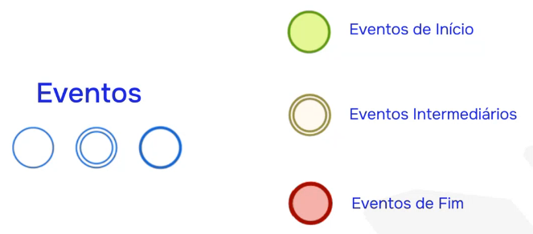
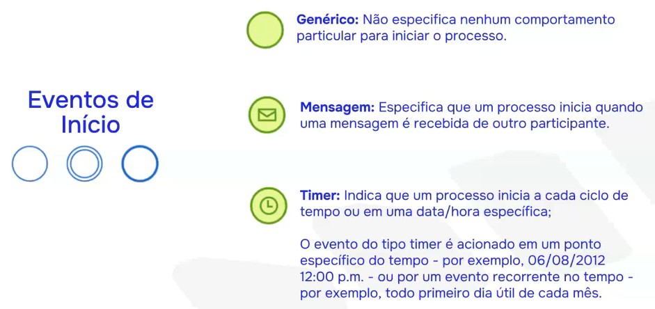
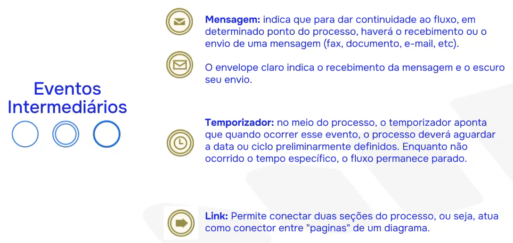
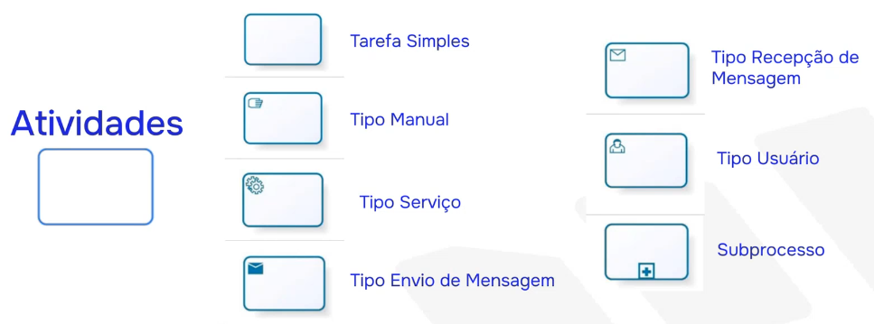

# Mapeamento de processos

## 🔶 Por que mapear processos?
- Aumentar a clareza e entendimento das rotinas
- Identificar gargalos e desperdícios
- Facilitar treinamentos e padronização
- Melhorar a comunicação e tomada de decisão
- Reduzir custos e aumentar produtividade

## 🔶 Termos
- Macroprocessos
- Processos
- Subprocessos
- Atividades
- Tarefas

Um processo (seja ele macro, sub etc) refere-se a uma sequência de ações ou etapas realizadas para atingir um determinado objetivo. 
É um conjunto de atividades inter-relacionadas por pessoas ou sistemas, que transformam entradas (insumos) em saídas (resultados), com objetivo de gerar valor para um cliente ou parte interessada.

## 🔶 Elementos de um processo
| Elemento | Descrição |
| ------- | --------- |
| Objetivo | Objetivo a ser alcançado com o processo |
| Eventos | Marcos que iniciam, pausam ou finalizam o processo |
| Atividades | Ações que são realizadas dentro do processo |
| Regras | Regras para o acontecimento do processo, como condição, critério e restrição |
| Tarefas | Procedimentos para o acontecimento do processo, passo a passo detalhado |
| Atores | Pessoas que estão inseridas no contexto do processo |
| Dono do processo | Responsável formal ou área responsável pelo funcionamento do processo |
| Stakeholders | Todos os envolvidos na execução do processo |

## 🔶 Tipos de processos
| Tipo | Descrição |
| ------- | --------- |
| Processos Primários (ou Finalísticos) | Ligados diretamente ao objetivo final da empresa, aquilo que vai entregar valor final ao cliente |
| Processos de Apoio (ou Suporte) | Vão dar apoio para que os processos primários atinjam os objetivos |
| Processos Estratégicos (ou Gerenciais) | Estão ligados a gestão e tomada de decisão da empresa |

## 🔶 Etapas para mapear um processo
1. Definir o processo a ser mapeado

    Priorize processos que:
    - Tenham impacto direto no cliente
    - Gerem retrabalho ou desperdício
    - Sejam executados com frequência
    - Estejam passando por mudanças ou problemas
    
2. Coletar informações
    - Quais áreas estão envolvidas?
    - Quais as entradas e saídas?
    - Quem executa o quê?
    - Prazos e frequências
    - Ferramentas e sistemas utilizados

3. Identificar e organizar as atividades
    - Oranize em ordem cronológica ou lógica
    - Anote os responsáveis (pessoas ou áreas)
    - Relacione entradas e saídas de cada atividade
    - Anote pontos de decisão e suas possibilidades

4. Representar graficamente (fluxograma)
    - Traduzir o processo para uma representação visual
    - O fluxograma ajuda a enxergar o processo de forma clara, rápida e lógica
    - BPMN é a linguagem mais comum para representação visual de processo

## 🔶 BPM X BPMN
`BPM` = Business Process Management (Gerenciamento de Processos de Negócio). 
É uma abordagem de compreender a organização por meio de processos.

`BPMN` = Business Process Model and Notation (Modelo e Notação de Processos de Negócio). 
É uma linguagem, é a forma como nos comunicamos nas representações visuais do mapeamento de processos.

## 🔶 BPMN - Elementos
Os elementos estão organizaados em 4 tipos:

| **Categoria**          | **Elemento**                            | **Descrição / Função**                                                            |
| ---------------------- | --------------------------------------- | --------------------------------------------------------------------------------- |
| **Objetos de Fluxo**   | **Eventos (Events)**                    | Algo que acontece (Início, Intermediário, Fim).                                   |
|                        | **Atividades (Activities)**             | Trabalho a ser feito (Tarefa, Subprocesso, Atividade de Chamada).                 |
|                        | **Gateways**                            | Controlam o fluxo (XOR – exclusivo, OR – inclusivo, AND – paralelo, Event-based). |
| **Objetos de Conexão** | **Fluxo de Sequência (Sequence Flow)**  | Define a ordem de execução dentro do processo.                                    |
|                        | **Fluxo de Mensagem (Message Flow)**    | Comunicação entre pools (participantes diferentes).                               |
|                        | **Associação (Association)**            | Liga atividades/eventos a artefatos ou informações adicionais.                    |
| **Artefatos**          | **Objeto de Dados (Data Object)**       | Dados usados ou produzidos em uma atividade.                                      |
|                        | **Armazenamento de Dados (Data Store)** | Representa um repositório persistente de dados.                                   |
|                        | **Grupo (Group)**                       | Agrupa elementos relacionados, sem alterar o fluxo.                               |
|                        | **Anotação de Texto (Text Annotation)** | Observações ou notas explicativas.                                                |
| **Swimlanes**          | **Piscina (Poll)**                      | Representa um participante (organização, sistema, entidade).                      |
|                        | **Raia (Raia)**                         | Subdivisão da piscina (papel, função, departamento). As raias podem ser funções, locais, departamentos etc, mas se uma raia representar uma função, todas as demais também deverão representar funções; Uma não pode representar função e outra departamento por exemplo.|

### 📷 Exemplos

